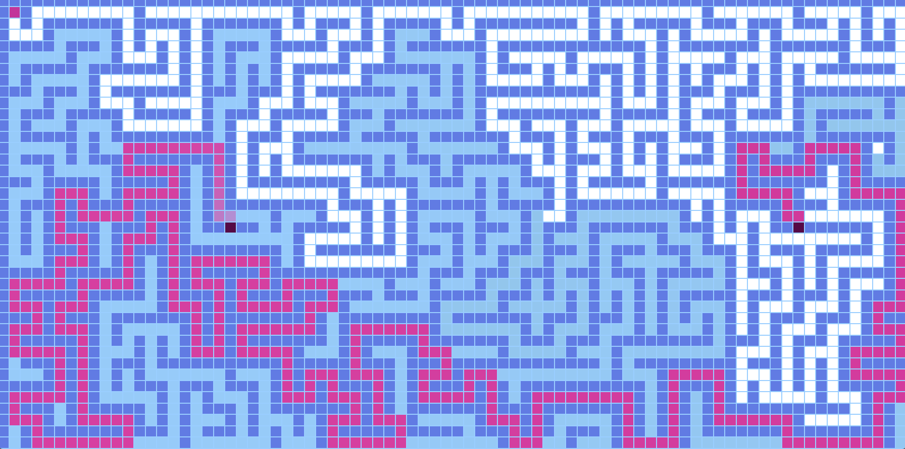

##PathFinder visualization
***
###Description

This project visualizes how do path finding algorithms work.
For now just _Dijkstra_ algorithm is implemented but 
_A*_ algorithm is supposed to be done as well.

Idea on the project was taken from _Clément Mihailescu_.
Link to his video [click](https://www.youtube.com/watch?v=n4t_-NjY_Sg)

###Instruction

- draw walls pressing _RIGHT_ key
- press _arrowUp_ to add random walls
- press _m_ to generate random maze
- drag startNode and targetNode pressing _RIGHT_ key
- press _ENTER_ to display the path
- press _arrowDown_ to remove all the walls

